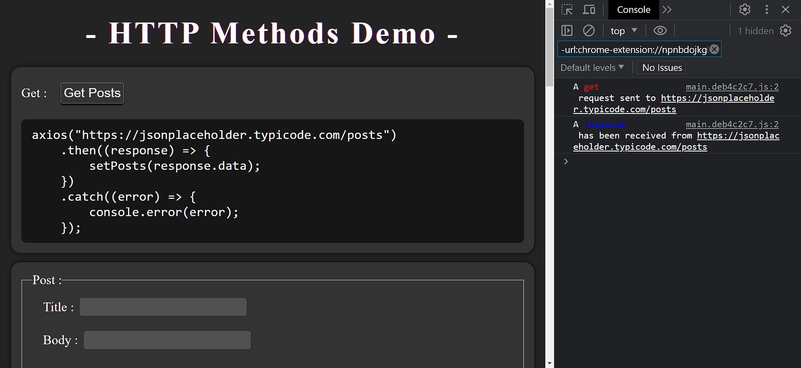

<h1>HTTP Methods Demo</h1>

    Welcome to the <strong>HTTP Methods Demo</strong> repository, a
    comprehensive showcase of HTTP communication methods built using React. This
    project not only features a sleek and user-friendly dark theme but also
    provides a hands-on learning experience for interacting with HTTP requests
    and responses using the Axios library. Whether you're new to HTTP or a
    seasoned developer looking to brush up your skills, this repository is your
    go-to resource.

    

<h2>Features</h2>
<ul>
    <li>
        

            <strong>GET:</strong> Explore the power of HTTP GET requests by
            fetching data from a server. The response data is displayed in the
            console, with clear color-coded formatting making it easy to
            distinguish between requests (in red) and responses (in blue).
        

    </li>
    <li>
        

            <strong>POST:</strong> Create and send new data to the server by
            completing the title and body inputs. Click the "Post Req" button to
            send your request, and the newly created post will be displayed in
            the response section.
        

    </li>
    <li>
        

            <strong>PATCH:</strong> Modify existing data on the server using
            HTTP PATCH requests. Provide the required input values, click the
            "Patch Req" button, and witness the changes reflected in the
            response.
        

    </li>
    <li>
        

            <strong>PUT:</strong> Similar to PATCH, the PUT method allows you to
            update data on the server. Fill in the necessary information, click
            the "Put Req" button, and observe the updated data in the response
            section.
        

    </li>
    <li>
        

            <strong>DELETE:</strong> Learn how to remove data from the server
            with HTTP DELETE requests. Click the "Delete Req" button, and the
            relevant data will be deleted, with the confirmation displayed in
            the response.
        

    </li>
    <li>
        

            <strong>Exception Handling:</strong> Experience error handling with
            the "Catch Req" section. See how to handle errors gracefully and
            display them in the console.
        

    </li>
</ul>
<h2>Live Demo</h2>

    Experience this React project live by visiting the
    <a href="https://ali-sdg90.github.io/HTTP-Methods-Demo/" target="_new"
        >HTTP Methods Demo</a
    >
    website.

<h2>Repository</h2>

    Explore the code and contribute to the project on
    <a href="https://github.com/Ali-Sdg90/HTTP-Methods-Demo/" target="_new"
        >GitHub</a
    >. Feel free to raise issues or submit pull requests to enhance this
    valuable resource for HTTP and Axios learners.

